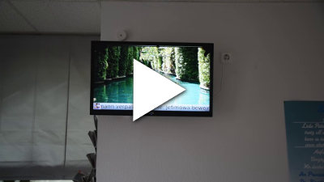
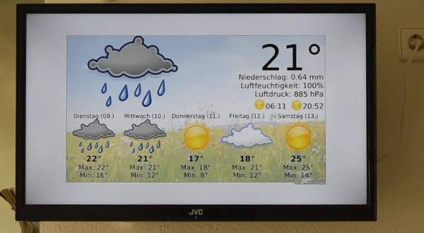

qante
=====

qante is a QML-based framework to create standalone presentations, e.g., on TVs
in a waiting room. It was designed to offer a smooth experience even on embedded
devices like a [Raspberry Pi](https://www.raspberrypi.org/) 2 or 3.

Impressions
-----------

*Please note:* the photographs used in the following are not included in this repository

Demo video of qante on a Raspberry Pi 2 with [RPibuntu](http://rpibuntu.kicherer.org/www/)
connected to a FullHD TV in a waiting room:

Screenshot of the weather widget:

Available widgets
-----------------

* Slideshow - animated display of still images
* Simple HTML - display a simple HTML page
* Ticker - show RSS/Atom feeds as scrolling text 
* Weather - weather from openweathermap.org
* Webview - show a complex web page using QT's built-in browser

Usage
-----

1. Create a screenplay.qml. For example:

		import QtQuick 2.5
		import QtQuick.Window 2.2

		Item {
			Component.onCompleted: {
				// show a simple HTML page with a scrolling ticker on the bottom
				{
					var args = {}
					var scene
					var ticker
					
					scene = newWidget(qante, "Scene", args)
					
					args = {
						"feedType": ["atom"],
						"urls": [
							"http://rpibuntu.kicherer.org/www/feeds/news.atom.xml",
						],
						"namespaces": ["http://www.w3.org/2005/Atom"]
					}
					
					ticker = newWidget(scene, "ticker", args)
					ticker.z = 1 // ensure ticker is always visible on top
					
					args = {"htmlURL": "example1.html"}
					newWidget(scene, "simple_html", args)
					
					addScene(scene)
				}
			}
		}
	
	(an full example is available under `doc/screenplay.qml.example`)

2. Execute: `qmlscene --fullscreen quante.qml`

License
-------
qante is released under GPLv3.

The weather icons under `resources/weather/` are copied from the Gnome Desktop Tango Icon theme (v3.12.0)
which is released under the [GNU LGPL v.3](https://www.gnu.org/licenses/lgpl-3.0.en.html) or 
[Creative Commons BY-SA 3.0](https://creativecommons.org/licenses/by-sa/3.0/) license.
